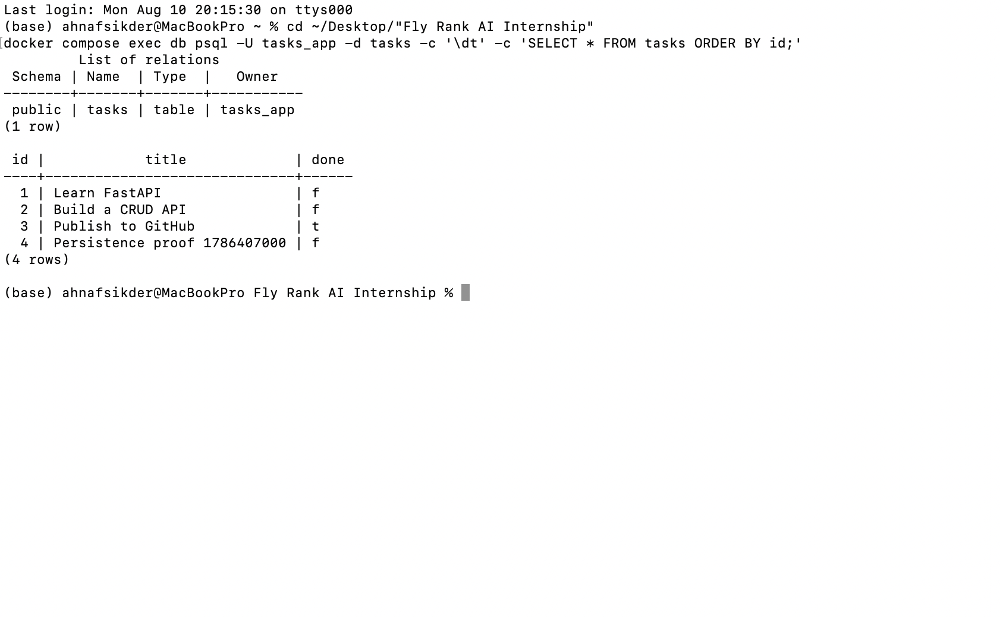
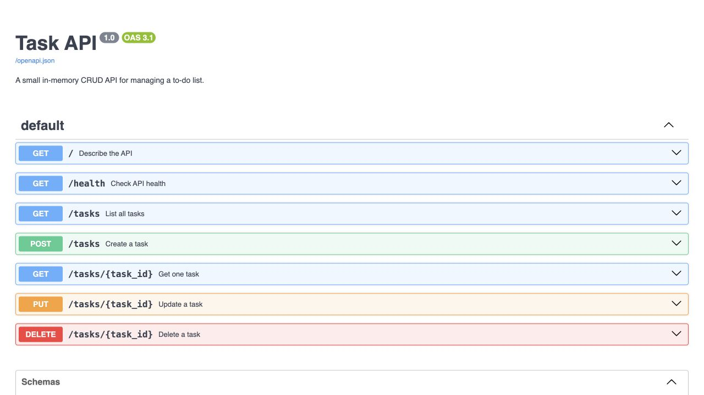

# Task API

A FastAPI CRUD service backed by PostgreSQL and run as a two-container Docker Compose stack. This repository contains the FlyRank Backend AI Engineering assignments BE-01, BE-02, and BE-04.

## Start the stack

Requirements:

- Docker Desktop
- Docker Compose v2

Copy the environment template, then start both the API and PostgreSQL:

```bash
cp .env.example .env
docker compose up --build
```

The services are then available at:

- API: [http://localhost:8000](http://localhost:8000)
- Swagger UI: [http://localhost:8000/docs](http://localhost:8000/docs)
- Health check: [http://localhost:8000/health](http://localhost:8000/health)

Run in the background with:

```bash
docker compose up --build --detach
```

Stop the containers without deleting PostgreSQL data:

```bash
docker compose down
```

Do not add `--volumes` when you want to keep the database.

## Environment variables

`.env` is intentionally ignored by Git. `.env.example` documents every required value.

| Variable | Purpose |
| --- | --- |
| `POSTGRES_DB` | Database created by the PostgreSQL image |
| `POSTGRES_USER` | Local database user |
| `POSTGRES_PASSWORD` | Local database password |
| `DATABASE_URL` | Psycopg connection string used by the API |
| `PORT` | Host port mapped to the API container |

The hostname in `DATABASE_URL` is `db`, matching the PostgreSQL service name in `docker-compose.yml`.

## Architecture

```text
HTTP request
    -> FastAPI route (main.py)
    -> TaskService (service.py)
    -> TaskRepository interface (repositories/base.py)
    -> PostgresTaskRepository (repositories/postgres.py)
    -> PostgreSQL
```

The A2 version stored data directly in SQLite route functions, so it did not yet have the interface described by the A3 brief. For A3, the storage operations were extracted behind `TaskRepository`, and `TaskService` was added between the routes and repository. PostgreSQL is now selected in `dependencies.py`.

The public route paths, request bodies, success codes, validation rules, and error responses did not change during the PostgreSQL migration. The service contains no SQL and the routes do not import Psycopg. Future storage changes require a new repository implementation and one wiring change rather than another route rewrite.

## Database initialization and persistence

`sql/init.sql` creates the `tasks` table and inserts three initial rows. Docker mounts this file into `/docker-entrypoint-initdb.d/`, so PostgreSQL runs it when the named volume is created for the first time.

The named volume `postgres_data` stores `/var/lib/postgresql/data`. `docker compose down` removes the containers and network but keeps that volume. When the stack is recreated, PostgreSQL attaches the same data directory.

Persistence was checked with `scripts/verify_persistence.sh`. The script:

1. Creates a uniquely named task through `POST /tasks`.
2. Runs `docker compose down` to remove both containers.
3. Rebuilds and recreates both containers with `docker compose up --build --detach`.
4. Waits for `/health` to succeed.
5. Fetches `/tasks` and confirms the unique task is still present.

The following screenshot is from the running PostgreSQL container after the persistence check. It shows the `tasks` table and the row that survived container recreation.



Run the same proof with:

```bash
sh scripts/verify_persistence.sh
```

Only use the following when you intentionally want to erase the local database and rerun `init.sql`:

```bash
docker compose down --volumes
```

## Endpoints

| Method | Path | Description | Success status |
| --- | --- | --- | --- |
| GET | `/` | API metadata | 200 |
| GET | `/health` | Check API and PostgreSQL | 200 |
| GET | `/tasks` | List all tasks | 200 |
| GET | `/tasks/{id}` | Get one task | 200 |
| POST | `/tasks` | Create a task with `title` | 201 |
| PUT | `/tasks/{id}` | Update `title` and/or `done` | 200 |
| DELETE | `/tasks/{id}` | Delete a task | 204 |

Unknown task IDs return a JSON `404` error. POST and PUT reject invalid input with a JSON `400` error.

## Example request

```console
$ curl -i -X POST http://localhost:8000/tasks \
  -H "Content-Type: application/json" \
  -d '{"title":"Prove PostgreSQL persistence"}'
HTTP/1.1 201 Created
content-type: application/json

{"id":4,"title":"Prove PostgreSQL persistence","done":false}
```

## Useful Docker commands

```bash
# Show container state and health
docker compose ps

# Follow API and database logs
docker compose logs --follow app db

# Open psql inside the database container
docker compose exec db psql -U tasks_app -d tasks

# Query the table directly
docker compose exec db psql -U tasks_app -d tasks -c "SELECT * FROM tasks ORDER BY id;"
```

## Previous assignment evidence

The earlier SQLite exploration remains in `sql/exploration.sql`, and its database-viewer screenshot remains under `docs/`. The active application storage for BE-04 is PostgreSQL.


