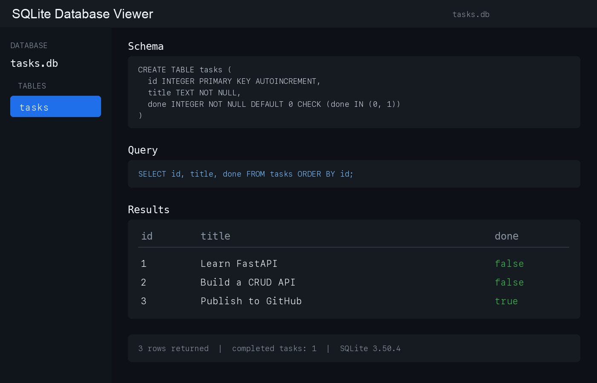

# Task API

A SQLite-backed CRUD API for managing a to-do list. It was built with FastAPI for FlyRank's Backend AI Engineering database assignment (BE-02).

## Run it

```bash
python3 -m venv .venv
.venv/bin/python -m pip install -r requirements.txt
.venv/bin/python -m uvicorn main:app --reload
```

The API runs at `http://127.0.0.1:8000`. Interactive Swagger UI is available at [http://127.0.0.1:8000/docs](http://127.0.0.1:8000/docs).

## Endpoints

| Method | Path | Description | Success status |
| --- | --- | --- | --- |
| GET | `/` | API metadata | 200 |
| GET | `/health` | Server health check | 200 |
| GET | `/tasks` | List all tasks | 200 |
| GET | `/tasks/{id}` | Get one task | 200 |
| POST | `/tasks` | Create a task with `title` | 201 |
| PUT | `/tasks/{id}` | Update a task's `title` and/or `done` status | 200 |
| DELETE | `/tasks/{id}` | Delete a task | 204 |

Unknown task IDs return a JSON `404` error. POST and PUT reject missing or blank titles with a JSON `400` error.

## SQLite database

SQLite was chosen because it provides real persistent SQL storage without requiring a separate database server. Python includes SQLite support, so no additional database package or service is needed.

The application stores data in `tasks.db` beside `main.py`. On startup, it automatically:

1. Creates `tasks.db` if it does not exist.
2. Creates the `tasks` table if it does not exist.
3. Inserts three sample tasks only when the table is empty.

The database file is ignored by Git because each clone creates its own local database automatically.

### Database viewer



The required SQL exercises are saved in [`sql/exploration.sql`](sql/exploration.sql). For example, this query lists only completed tasks:

```sql
SELECT * FROM tasks WHERE done = 1;
```

Other explored queries list and count tasks, mark all tasks complete, and delete completed tasks. Changes made directly through SQLite are immediately visible through the API.

## Example request

```console
$ curl -i -X POST http://127.0.0.1:8000/tasks \
  -H "Content-Type: application/json" \
  -d '{"title":"Buy milk"}'
HTTP/1.1 201 Created
content-type: application/json

{"id":4,"title":"Buy milk","done":false}
```

Restarting the server does not remove created tasks because every CRUD operation now reads from or writes to SQLite.

## Swagger UI

FastAPI generates interactive OpenAPI documentation automatically. Use **Try it out** in Swagger UI to create, list, update, and delete tasks without curl.


